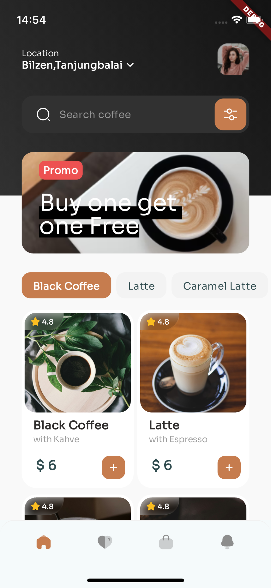
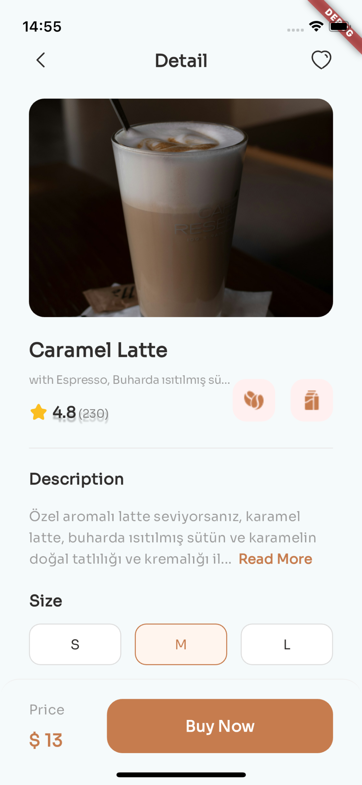
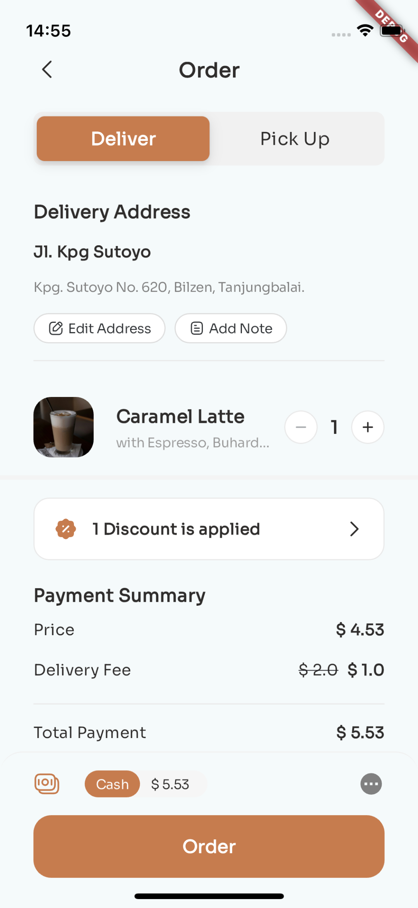
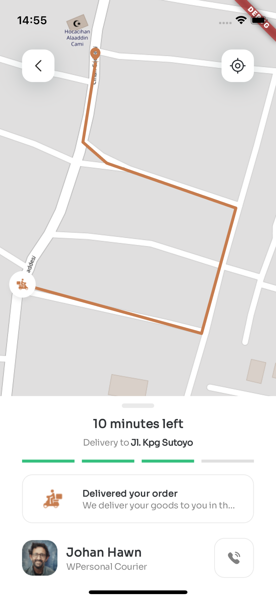

# Coffee Shop

## Description
Coffee Shop is a mobile application that allows users to search for coffee and place orders for coffee delivery.

## Screenshots
<p float="left">
  
  
  
  
  
</p>

### Prerequisites
- Flutter SDK
- Dart SDK

### Installation Steps
1. Clone this repository:
    ```bash
    git clone https://github.com/username/coffee-shop.git
    ```
2. Navigate to the project directory:
    ```bash
    cd coffee-shop
    ```
3. Install the required packages:
    ```bash
    flutter pub get
    ```
4. Run the application:
    ```bash
    flutter run
    ```

## Usage
Once the application is launched, you can search for coffee and place orders for coffee delivery. The coffee delivery feature allows you to get your favorite coffee delivered to your doorstep easily.

### Key Features
- Provide detailed information about coffee
- User-friendly interface

## Libraries Used
- `google_fonts`: To use Google fonts
- `flutter_svg`: To display SVG format icons
- `flutter_map`: For map components
- `latlong2`: For geographical coordinates
- `intl`: For international date and time formats
- `dio`: For HTTP requests
- `bloc`: For state management
- `flutter_bloc`: Integration for Bloc with Flutter
- `equatable`: For object comparisons


